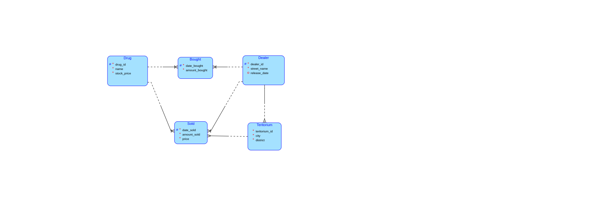

# Sledovani dealeru preprodavajicich drogy

Na malem modelu databaze se podivame na to jak dealeri prebiraji a nasledne preprodavaji drogy. Budeme sledovat kolik
prodali ci neprodali a kolik nam aktualne dluzi. Zda dealeri nejsou aktualne ve vezeni. Plus zda prodavaji pouze ve svem
teritoriu nebo se snazi expandovat ke konkurenci.

## Model

Z DBS portalu mame 2 rozlozene M:N vazby mezi Dealerem a Drogou ktere sleduji Prodej a Nakup. Posledni entita je
teritorium ktere "patri" dealerovi a kde jsou drogy prodavany.



## Nasazeni

* [create.sql](create.sql)
    * (vcetne drop scriptu)
* [insert.sql](insert.sql)
    * (generovan konstruktem "do" -> nahodna data pri kazdem spusteni)
    * Vyuziva podobny select jako [get_dealer_drug_avg_json.sql](Procedure/get_dealer_drug_avg_json.sql) pro tvorbu
      verohodnych dat.

# Scenar

Kazdy mesic dostaneme od ucetniho faktury v excelu obsahujici kolik si kazdy dealer na tenhle mesic nakoupil drog a
kolik jich prodal za predchozi mesic. Tato data potrebujeme importovat do databaze abychom s nima mohli nasledne
pracovat.

Vysledky chceme 3 typu.

1) Ve formatu JSON aby mohl byt ve webovem GUI zpracovan a vykreslen do grafu se statistikami. K tomu mame
   nasledujici funkce, jenz poskytuji ruzne statistiky o prodeji drog dealery v ruznych teritoriich.
2) Ve formatu MD data o teritoriich, ktere se mohou rovnou zobrazovat jako jejich statistiky na strance.
3) Ve formatu XML pro uzivateli specifikovane tabulky a pripadna ID abychom byli schopni efektivne vytvaret a prenaset
   data v jednom souboru.

## Nabidka funkci

1) [Agregace prace dealeru](#1-agregace-prace-dealeru)

    * Pro vybraneho delaera (nebo vsechny dealery) a casovy interval. Vraci statistiky jak si vedl, kolik nam dluzi, jak
      se v kazdem teritoriu prodava, atd...
    * Vraci ve formatu JSON pro GUI [webove rozhrani](Outputs/index.html).
    * [get_dealer_stats_json.sql](Procedure/get_dealer_stats_json.sql) slozka s kodem.

2) [Statistika teritorii](#2-statistika-teritorii)

    * Poskytne statistiky o teritoriich (teritoriu).
    * generuje [MD soubor](Outputs/README.md) ktery se nasledne muze zobrazit na strance.
    * [get_teritory_stats_md.sql](Procedure/get_teritory_stats_md.sql) slozka s kodem.

3) [XML tabulky](#3-xml-tabulky)

    * Vraci pro jmena tabulek a pripadne jejich id, XML soubor s daty o tabulce a zadanym obsahem.
    * Generuje jeden [XML soubor](Outputs/data.xml) ktery obsahuje vsechny tabulky.
    * [get_tables_xml.sql](Procedure/get_tables_xml.sql) slozka s kodem.

## Pomocne funkce

1) [trigger_stage_sold](Procedure/trigger_stage_sold.sql) / [bought](Procedure/trigger_stage_bought.sql)

    * Triggery jenz zajistuji mapovani id na jmena z CSV souboru.

2) [copy_invoice('absolute bought path', 'absolute sold path')](Procedure/copy_invoice.sql)

    * Zajisti zkopirovani CSV souboru do databaze.

3) [update_dealers_mv_stats](Procedure/update_dealers_mv_stats.sql)

    * Vytvari Materialized View po vlozeni novych dat.

## Faktury (vstupni data)

Ucetni nam dava data bez ID ale s unikatnimi nazvy Drog a Dealeru proto si vytvorime pomocnou tabulku do ktere to
vlozime nasledne namapujeme ID a nakonec vlozime do skutecne tabulky. Celou tuto logiku budou obstaravat triggery ktery
sleduji pomocne tabulky.

Trigger je pouzit pro uzivatele IDE kteri pro COPY nevyuzivaji consoly ale zabudovanou funkci IDE.

* [import_bought.csv](import_bought.csv)

| date_bought | drug_name | dealer_name | amount_bought |
|-------------|-----------|-------------|---------------|
| 2024-03-01  | Cocaine   | El Chapo    | 150           |
| 2024-03-01  | Heroin    | El Chapo    | 120           |

* [import_sold.csv](import_sold.csv)

| date_sold  | drug_name | dealer_name | teritorium_city | teritorium_district | amount_sold | price |
|------------|-----------|-------------|-----------------|---------------------|-------------|-------|
| 2024-04-01 | Cocaine   | El Chapo    | Culiacán        | Centro              | 5           | 250   |
| 2024-04-01 | Heroin    | El Chapo    | Culiacán        | Tres Ríos           | 20          | 550   |

Pri pouzivani console lze predat cestu k temto 2 souborum procedure ktera zajisti jejich z kopirovani.

```sql
CALL copy_invoices('absolute bought path', 'absolute sold path');
```

Po vlozeni trigger rovnez vytvori novy materializovany pohled pro celkovy prehled zamestnancu a jejich vysledku od
pocatku uvazku az do poslednich dat.

## Statistiky (vystupni data)

### 1) Agregace prace dealeru

#### 1.1) Scenar funkce

Pro vybraneho delaera (nebo vsechny dealery) a casovy interval. Vraci statistiky jak si vedl, kolik nam dluzi, jak
se v kazdem teritoriu prodava, atd...

[get_dealer_stats_json.sql](Procedure/get_dealer_stats_json.sql) slozka s kodem.

```sql
-- id dealera nebo defaultne NULL
SELECT get_dealer_stats_json('datum volitelny, default current_date()', NULL); 
```

#### 1.2) Podpurne funkce

Dale v sobe vyuziva dve funkce ktere lze rovnez volat pomoci selectu. Jejichz spojenim vznika finalni vystup. (Volani
techto funkci je identicke).

1) [get_dealer_avg_json.sql](Procedure/get_dealer_avg_json.sql)
    * Vraci celkove staty pro dealera.
    * [Vystup](Outputs/dealers_avg.json)
2) [get_dealer_drug_avg_json.sql](Procedure/get_dealer_drug_avg_json.sql)
    * Vraci staty pro dvojice dealer/droga.
    * [Vystup](Outputs/dealers_drugs_avg.json)

#### 1.3) Vystup

Provizorni webova stranka s pouzitim vygenerovanych json dat pro generaci grafu [index.html](Outputs/index.html).

* [Cely vystup](Outputs/dealers.json)
* Pro dealer_id = 1.
* Data v "dealers" jsou generovana funkci [get_dealer_avg_json.sql](Procedure/get_dealer_avg_json.sql).
* Data v "data" jsou generovana [get_dealer_drug_avg_json.sql](Procedure/get_dealer_drug_avg_json.sql)
* Finalne [get_dealer_stats_json.sql](Procedure/get_dealer_stats_json.sql) namapuje data spravnemu dealerovi.

```json
{
  "dealers": [
    {
      "street_name": "El Chapo",
      "amount_bought": "7607",
      "amount_payed": "56277",
      "amount_sold": "7607",
      "amount_gained": "60474",
      "debt": "0",
      "profit": "4197",
      "data": [
        {
          "drug_name": "Ketamine",
          "amount_bought": "1320",
          "amount_payed": "5280",
          "amount_sold": "1320",
          "amount_gained": "6237",
          "debt": "0",
          "profit": "957"
        },
        {
          "drug_name": "Crack Cocaine",
          "amount_bought": "833",
          "amount_payed": "9996",
          "amount_sold": "833",
          "amount_gained": "9699",
          "debt": "0",
          "profit": "-297"
        },
        {
          "drug_name": "LSD",
          "amount_bought": "435",
          "amount_payed": "1305",
          "amount_sold": "435",
          "amount_gained": "1426",
          "debt": "0",
          "profit": "121"
        },
        {
          "drug_name": "Heroin",
          "amount_bought": "817",
          "amount_payed": "6536",
          "amount_sold": "817",
          "amount_gained": "6002",
          "debt": "0",
          "profit": "-534"
        },
        {
          "drug_name": "MDMA (Ecstasy)",
          "amount_bought": "400",
          "amount_payed": "800",
          "amount_sold": "400",
          "amount_gained": "1077",
          "debt": "0",
          "profit": "277"
        },
        {
          "drug_name": "Psilocybin Mushrooms",
          "amount_bought": "933",
          "amount_payed": "13995",
          "amount_sold": "933",
          "amount_gained": "14965",
          "debt": "0",
          "profit": "970"
        },
        {
          "drug_name": "Cocaine",
          "amount_bought": "386",
          "amount_payed": "3860",
          "amount_sold": "386",
          "amount_gained": "4333",
          "debt": "0",
          "profit": "473"
        },
        {
          "drug_name": "Methamphetamine",
          "amount_bought": "526",
          "amount_payed": "3682",
          "amount_sold": "526",
          "amount_gained": "4247",
          "debt": "0",
          "profit": "565"
        },
        {
          "drug_name": "Marijuana",
          "amount_bought": "919",
          "amount_payed": "4595",
          "amount_sold": "919",
          "amount_gained": "4600",
          "debt": "0",
          "profit": "5"
        },
        {
          "drug_name": "PCP (Angel Dust)",
          "amount_bought": "1038",
          "amount_payed": "6228",
          "amount_sold": "1038",
          "amount_gained": "7888",
          "debt": "0",
          "profit": "1660"
        }
      ]
    }
  ]
}
```

### 2) Statistika teritorii

#### 2.1) Scenar funkce

Pro vybraneho teritorium (nebo vsechny teritoria) a casovy interval. Vraci statistiky kolik a kym se prodavalo. Aby to
mohlo byt rovnou zobrazeno na webu format je vracen ve formatu MD.

[get_teritory_stats_md.sql](Procedure/get_teritory_stats_md.sql) slozka s kodem.

```sql
-- id dealera kteremu pripada teritorium nebo defaultne NULL
SELECT get_teritory_stats_md('datum volitelny, default current_date()', NULL); 
```

#### 2.2) Podpurne funkce

Pouziva pouze 2 selecty, ktere se prochazi for loopem.
Ukazka prvniho jenz generuje data pro celou tabulku.

```sql
SELECT t2.city,
       t2.district,
       SUM(COALESCE(am_sold, 0))                            AS am_sold,
       SUM(COALESCE(am_sold_con, 0))                        AS am_sold_con,
       SUM(COALESCE(am_sold, 0) + COALESCE(am_sold_con, 0)) AS am_sum
FROM (SELECT city,
             district,
             SUM(CASE WHEN d.dealer_id = sold.dealer_id THEN amount_sold ELSE 0 END)  AS am_sold,
             SUM(CASE WHEN d.dealer_id <> sold.dealer_id THEN amount_sold ELSE 0 END) AS am_sold_con
      FROM teritorium
               JOIN public.sold ON teritorium.teritorium_id = sold.teritorium_id
               JOIN public.dealer ON dealer.dealer_id = sold.dealer_id
               JOIN public.dealer d ON d.dealer_id = teritorium.dealer_id
      WHERE d.dealer_id = id_dealer
        AND date_sold < datum
      GROUP BY city, district) AS ag
         RIGHT JOIN teritorium t2 ON t2.district = ag.district -- include teritoria with 0 sold
WHERE t2.dealer_id = id_dealer
GROUP BY ROLLUP (t2.city, t2.district) -- to get sum of all
HAVING t2.city IS NOT NULL
ORDER BY district
```

#### 2.3) Vystup

* Pro dealer_id = 1.
* Cely vystup zde [Adresar](Outputs) (pro zobrazeni na gitlabu) a samotna [Slozka](Outputs/README.md)

**Zacatek ukazky**

---

# Statistiky teritorii

Prehled jednotlivych teritorii se statistikami ohledne jejich celkoveho prodeje. Komu patri a na jake districty se deli.
Kolik zde bylo prodano drog. Kolik zde bylo prodano konkurencnimi dealery.

## 1) Culiacán

### 1.1) Celkove vysledky

**Spravuje: El Chapo**

| District            | Prodano spravcem | Prodano konkurenci | Prodano celkem |
|---------------------|------------------|--------------------|----------------|
| Centro              | 920              | 0                  | 920            |
| Infonavit Barrancos | 1302             | 142                | 1444           |
| Jardines del Humaya | 519              | 198                | 717            |
| Las Quintas         | 1775             | 1104               | 2879           |
| Los Pinos           | 789              | 499                | 1288           |
| Tres Ríos           | 629              | 63                 | 692            |
| **Celkem**          | **5934**         | **2006**           | **7940**       |

### 1.2) Jednotlive vysledkly

1) El Chapo - 5934
2) Carlos Lehder - 827
3) Freeway Ricky Ross - 384
4) Griselda Blanco - 273
5) Nicky Barnes - 233
6) Frank Lucas - 222
7) George Jung Beach - 50
8) Pablo Escobar - 17

**Konec ukazky**

---

### 3) XML tabulky

#### 3.1) Scenar funkce

Pro jednoduche generovani XML dat muze uzivatel napriklad v GUI zadat zadane tabulky a jake data z nich chce. Nasledne
nam tato funkce vrati jeden XML soubor obsahujici zadana data.

[get_tables_xml.sql](Procedure/get_tables_xml.sql) slozka s kodem.

#### 3.2) Podpurne funkce

Zde nejsou vyuzity diky zabudovanym XML funkcim. Rovnez se zde uplatnuje dynamicke SQL.

Avsak pro zadavani dat je zde vytvoren vlastni TYPE *PAIR_TYPE*.

```sql
CREATE TYPE PAIR_TYPE AS
(
    table_name TEXT,
    id_table   INT
);
```

#### 3.3) Vystup

* Funkce prijima pole *PAIR_TYPE*
* Volame:

```sql
SELECT get_tables_xml(ARRAY [('dealer', NULL)::PAIR_TYPE, ('teritorium', 1)::PAIR_TYPE]);
```

* Pro data viz vyse dostavame XML: ([slozka s vystupem](Outputs/data.xml))

```xml

<tables>
    <dealer><!--Data for table: dealer. And ID = ALL-->
        <info data="dealer_table_info">
            <tablename>dealer</tablename>
            <tablecols>
                <column>dealer_id - integer</column>
                <column>release_date - date</column>
                <column>street_name - character varying</column>
            </tablecols>
            <num_of_rows>10</num_of_rows>
        </info>
        <table xmlns:xsi="http://www.w3.org/2001/XMLSchema-instance">

            <row>
                <dealer_id>1</dealer_id>
                <street_name>El Chapo</street_name>
                <release_date xsi:nil="true"/>
            </row>

            <row>
                <dealer_id>2</dealer_id>
                <street_name>Pablo Escobar</street_name>
                <release_date xsi:nil="true"/>
            </row>

            <row>
                <dealer_id>3</dealer_id>
                <street_name>Griselda Blanco</street_name>
                <release_date xsi:nil="true"/>
            </row>

            <row>
                <dealer_id>4</dealer_id>
                <street_name>Freeway Ricky Ross</street_name>
                <release_date xsi:nil="true"/>
            </row>

            <row>
                <dealer_id>5</dealer_id>
                <street_name>Frank Lucas</street_name>
                <release_date xsi:nil="true"/>
            </row>

            <row>
                <dealer_id>6</dealer_id>
                <street_name>George Jung Beach</street_name>
                <release_date xsi:nil="true"/>
            </row>

            <row>
                <dealer_id>7</dealer_id>
                <street_name>Carlos Lehder</street_name>
                <release_date xsi:nil="true"/>
            </row>

            <row>
                <dealer_id>8</dealer_id>
                <street_name>Felix Mitchell</street_name>
                <release_date xsi:nil="true"/>
            </row>

            <row>
                <dealer_id>9</dealer_id>
                <street_name>Nicky Barnes</street_name>
                <release_date>2025-05-10</release_date>
            </row>

            <row>
                <dealer_id>10</dealer_id>
                <street_name>Miguel Angel</street_name>
                <release_date>2025-05-10</release_date>
            </row>

        </table>
    </dealer>
    <teritorium><!--Data for table: teritorium. And ID = 1-->
        <info data="teritorium_table_info">
            <tablename>teritorium</tablename>
            <tablecols>
                <column>teritorium_id - integer</column>
                <column>dealer_id - integer</column>
                <column>city - character varying</column>
                <column>district - character varying</column>
            </tablecols>
            <num_of_rows>67</num_of_rows>
        </info>
        <table xmlns:xsi="http://www.w3.org/2001/XMLSchema-instance">

            <row>
                <teritorium_id>1</teritorium_id>
                <dealer_id>1</dealer_id>
                <city>Culiacán</city>
                <district>Centro</district>
            </row>

        </table>
    </teritorium>
</tables>
```